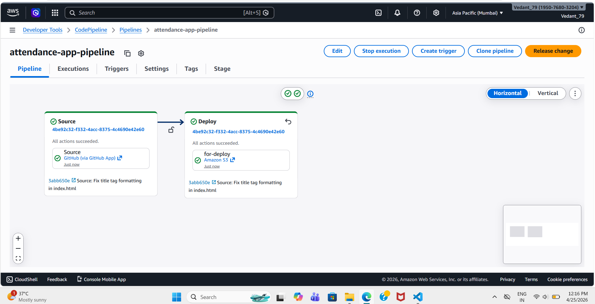
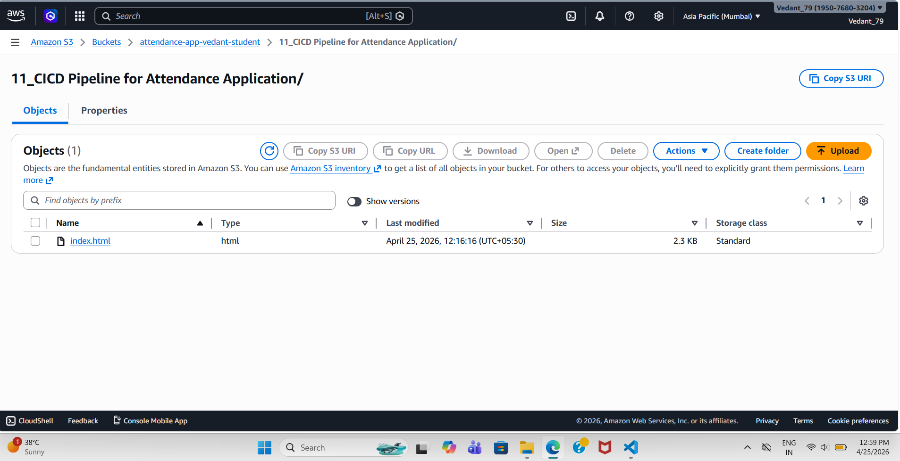
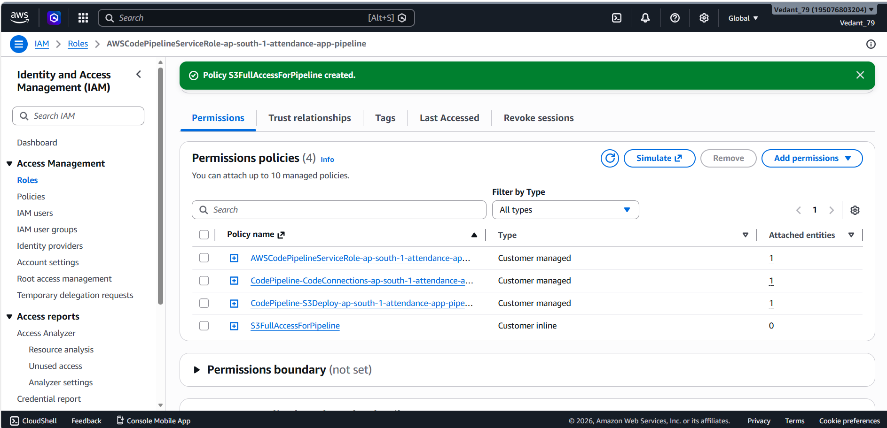

# 🚀 Project 11: CI/CD Pipeline for Attendance Application

## 📌 Project Overview

This project demonstrates how to build a **complete CI/CD pipeline using AWS services** to automatically deploy a static web application (Attendance System).

Whenever code is pushed to GitHub, the pipeline automatically deploys it to an S3 bucket — enabling **continuous integration and continuous delivery**.

---

## 🧰 AWS Services Used

* ⚙️ AWS CodePipeline
* 🔗 AWS CodeConnections (GitHub Integration)
* ☁️ Amazon S3 (Static Website Hosting)
* 🔐 IAM Roles & Policies

---

## 🏗️ Architecture

GitHub (Source) → CodePipeline → S3 Bucket (Deployment)

---

## 🔄 Workflow

1. Developer pushes code to GitHub
2. CodePipeline detects changes
3. Pipeline triggers automatically
4. Files are deployed to S3
5. Website updates instantly

---

## 📸 Screenshots

### 🔹 Pipeline Execution



### 🔹 S3 Bucket Setup



### 🔹 IAM Role Configuration



---

## 🌐 Live Application

👉 S3 Website URL:
http://attendance-app-vedant-student.s3-website-ap-south-1.amazonaws.com

---

## 📂 Project Structure

```
11_CICD_Pipeline_Attendance_App/
│
├── index.html
├── README.md
└── Screenshots/
    ├── Pipeline.png
    ├── S3_Bucket.png
    └── IAM.png
```

---

## 🎯 Key Features

✔ Automated deployment using CI/CD
✔ GitHub integration with AWS
✔ Static website hosting on S3
✔ Real-time updates on code push
✔ Scalable and serverless architecture

---

## 💡 What I Learned

* How CI/CD pipelines work in real-world projects
* Integrating GitHub with AWS CodePipeline
* Managing IAM roles and permissions
* Hosting static applications using S3
* Debugging deployment and permission issues

---

## 🏁 Conclusion

This project showcases a **production-level CI/CD pipeline setup** using AWS services.
It highlights automation, scalability, and real-time deployment — key skills required for cloud and DevOps roles.

---

## 👨‍💻 Author

**Vedant Satkar**
📧 [vedantssatkar@gmail.com](mailto:vedantssatkar@gmail.com)
🔗 [LinkedIn](https://www.linkedin.com/in/vedant-satkar-731bb2298)
💻 [GitHub](https://github.com/VedantSatkar)

---
