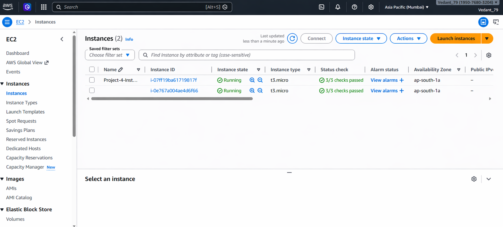
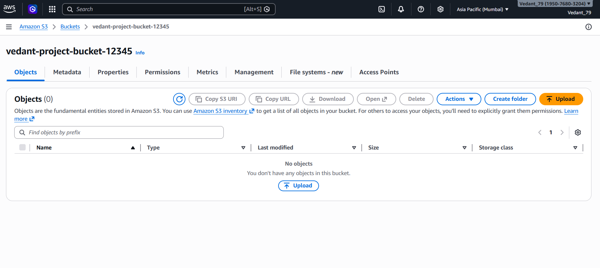
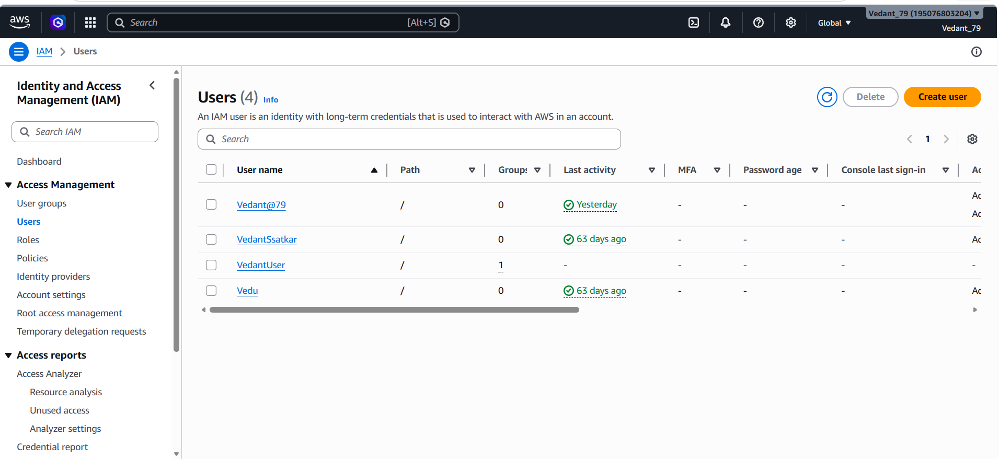

# 📦 AWS Resource Provisioning using Python (boto3)


---

## 🚀 Project Overview

This project demonstrates how to automate AWS infrastructure provisioning using Python and the boto3 SDK. Instead of manually creating resources in the AWS Console, all services are created programmatically.

💡 This project eliminates manual AWS console operations by fully automating infrastructure creation using code.

The project automates:

* EC2 Instance creation
* S3 Bucket creation
* IAM User creation

---

## 🎯 Objective

To build a real-world cloud automation project that:

* Reduces manual configuration
* Demonstrates Infrastructure as Code (IaC)
* Shows practical DevOps skills

---

## 🛠️ Tech Stack

* **Language:** Python
* **Library:** boto3
* **Cloud Platform:** AWS

### AWS Services Used:

* EC2 (Elastic Compute Cloud)
* S3 (Simple Storage Service)
* IAM (Identity and Access Management)

---

## 📁 Project Structure

```
aws-automation/
│
├── create_ec2.py      # Create EC2 instance
├── create_s3.py       # Create S3 bucket
├── create_iam.py      # Create IAM user
├── main.py            # Test AWS connection
├── screenshots/
│   ├── ec2_output.png
│   ├── s3_output.png
│   ├── iam_output.png
│   └── terminal_output.png
│
└── README.md
```

---

## ⚙️ Setup Instructions

### 1. Install boto3

```
pip install boto3
```

### 2. Configure AWS Credentials

```
aws configure
```

Enter:

* AWS Access Key
* AWS Secret Key
* Region (e.g., ap-south-1)
* Output format: json

---

## ▶️ How to Run

### Create EC2 Instance

```
python create_ec2.py
```

### Create S3 Bucket

```
python create_s3.py
```

### Create IAM User

```
python create_iam.py
```

---

## 📸 Output Screenshots

### EC2 Instance Created



### S3 Bucket Created



### IAM User Created



### Terminal Output


---

## ✅ Results

* Automated AWS resource provisioning successfully
* Created infrastructure using Python scripts
* Eliminated manual AWS Console dependency

---

## 💡 Key Learnings

* boto3 (client vs resource usage)
* AWS CLI configuration
* Cloud automation using Python
* Handling real-world AWS errors

---

## ⚠️ Important Notes

* EC2 instances may incur charges — stop them after use
* S3 bucket names must be globally unique
* IAM is a global service (not region-specific)

---

## 🔥 Future Enhancements

* Add logging and error handling
* Use configuration files (JSON/YAML)
* Build CLI-based automation tool
* Integrate with CI/CD pipeline

---

## 👨‍💻 Author - Vedant Satkar

📧 [vedantssatkar@gmail.com](mailto:vedantssatkar@gmail.com)
🔗 [Linkedin](https://www.linkedin.com/in/vedant-satkar-731bb2298/)
💻 [GitHub](https://github.com/VedantSatkar)

---