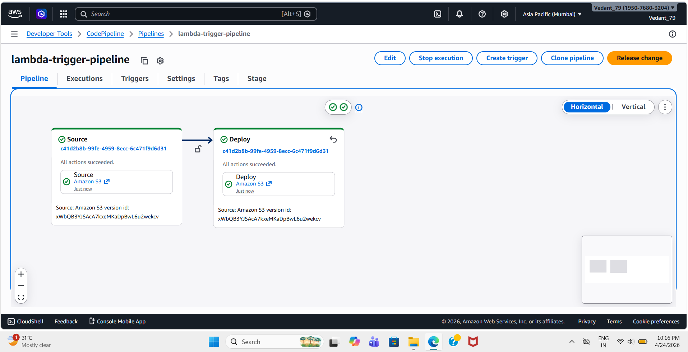
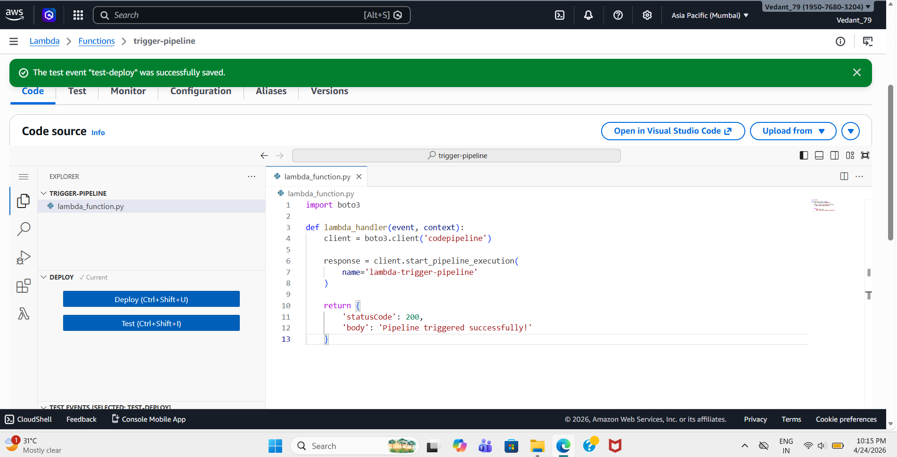
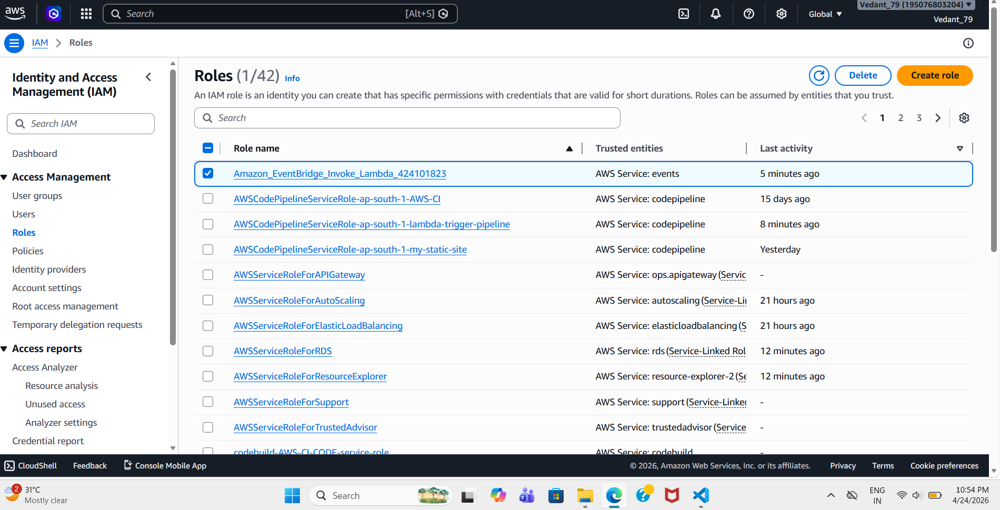
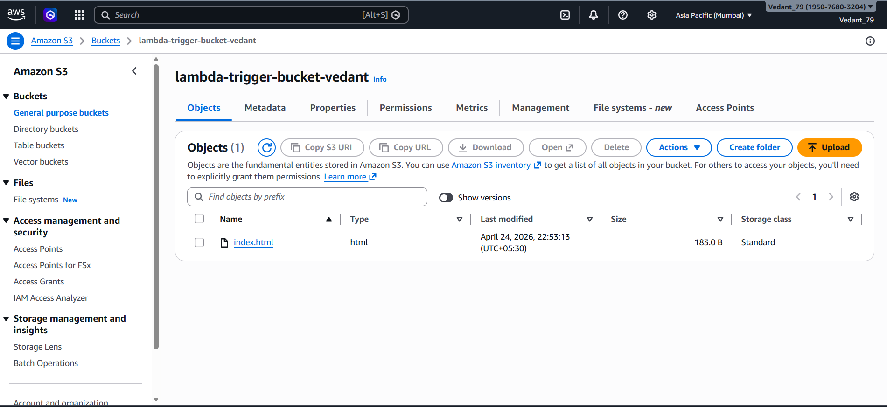

# 🚀 Automating CI/CD Pipeline using AWS Lambda & CodePipeline


---

## 📌 Project Overview

This project demonstrates how to automate CI/CD pipelines using AWS Lambda.  
Instead of triggering deployments manually or through GitHub webhooks, we use a serverless approach where a Lambda function programmatically triggers the pipeline.

This showcases event-driven DevOps automation, a key real-world concept used in modern cloud architectures.

---

## 🎯 Objective

✔️ Automate deployment process using Lambda  
✔️ Trigger CI/CD pipeline programmatically  
✔️ Understand integration between AWS services  
✔️ Build an event-driven deployment workflow  

---

## 🧰 AWS Services Used

🔹 AWS Lambda (Serverless compute)  
🔹 AWS CodePipeline (CI/CD automation)  
🔹 Amazon S3 (Object storage for source code)  

---

## 🏗️ Architecture

```
AWS Lambda
    ↓
Trigger
    ↓
AWS CodePipeline
    ↓
Fetch Source from S3
    ↓
Deploy to S3
```

---

## ⚙️ Project Workflow

1. Source code (index.html) is stored in an Amazon S3 bucket  
2. AWS CodePipeline is configured with:  
   - Source Stage → Amazon S3  
   - Deploy Stage → Amazon S3  
3. AWS Lambda function is created  
4. Lambda uses boto3 to trigger CodePipeline  
5. On execution, pipeline runs automatically  

---

## 🧩 Lambda Function Code

```python
import boto3

def lambda_handler(event, context):
    client = boto3.client('codepipeline')
    
    response = client.start_pipeline_execution(
        name='lambda-trigger-pipeline'
    )
    
    return {
        'statusCode': 200,
        'body': 'Pipeline triggered successfully!'
    }
```

---

## 🔐 IAM Permissions

Lambda role includes:

- AWSLambdaBasicExecutionRole  
- AWSCodePipelineFullAccess  

This allows Lambda to:

- Write logs (CloudWatch)  
- Trigger pipeline execution  

---
## 📸 Screenshots to Include (Recommended)

### 🔹 CodePipeline Successful Execution


### 🔹 Lambda Test Execution


### 🔹 IAM Role Permissions


### 🔹 S3 Bucket Configuration


---

## 🚨 Challenges Faced

- Understanding S3 permissions (Access Denied issue)  
- Differentiating source vs deployment bucket  
- Configuring IAM roles correctly  

---

## 💡 Key Learnings

- How CI/CD pipelines work in AWS  
- Serverless automation using AWS Lambda  
- IAM role-based access control  
- Event-driven architecture concepts  

---

## 🚀 Future Improvements

- Trigger pipeline on S3 upload automatically  
- Integrate with GitHub instead of S3  
- Add build stage using CodeBuild  
- Deploy static website with public access  
- Use CloudFront for CDN  

---

## 🏁 Conclusion

This project demonstrates a real-world DevOps workflow using AWS.

By integrating AWS Lambda with AWS CodePipeline, we achieved:

✔️ Automated deployments  
✔️ Serverless architecture  
✔️ Event-driven CI/CD  

---

## 👨‍💻 Author - Vedant Satkar

📧 Email: vedantssatkar@gmail.com  
💼 [LinkedIn](https://www.linkedin.com/in/vedant-satkar-731bb2298/)
💻 [GitHub](https://github.com/VedantSatkar)  

---
